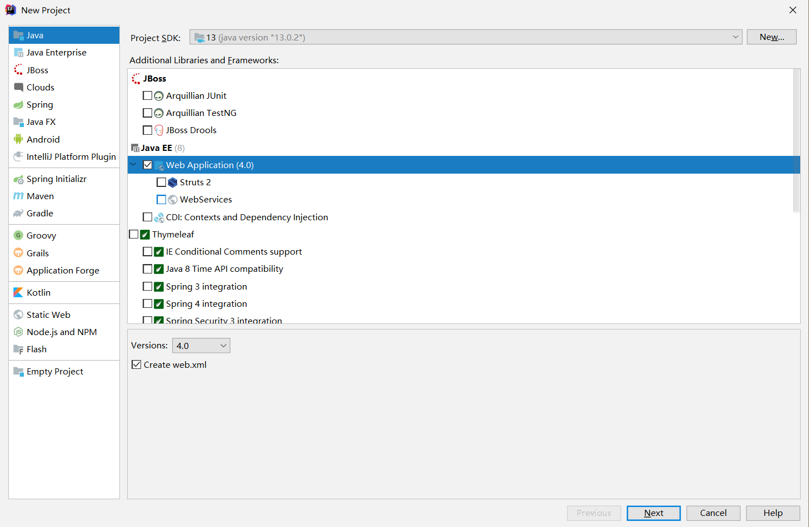
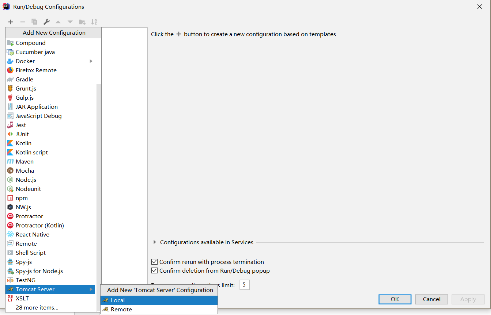
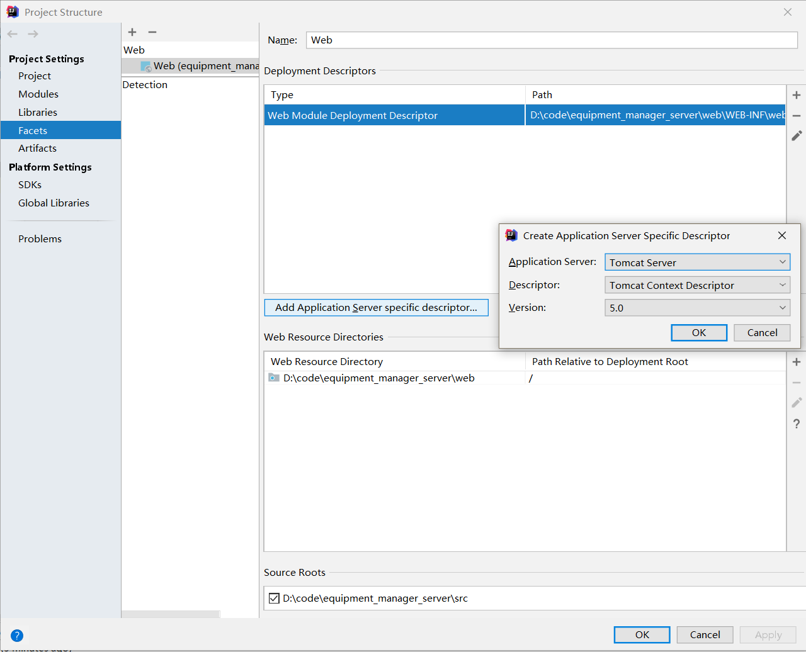
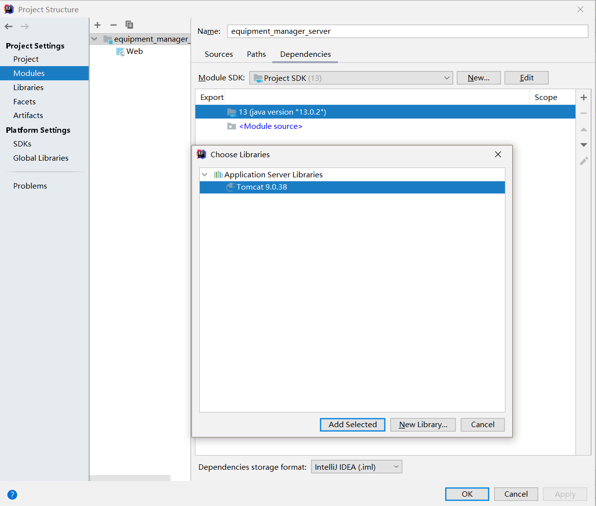
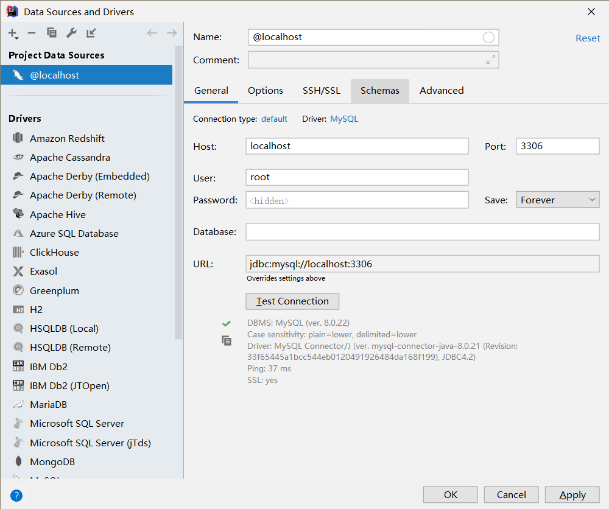

# 设备管理服务器端

## 项目建立
项目使用`Tomcat`作为服务器，`MySQL`作为数据库
选择Java项目


## 调试运行
先添加`Tomcat`


## 配置`Tomcat`的数据库连接池
项目结构中

键入数据库信息

添加`MySQL`数据库`JDBC`驱动库

## 导入`Tomcat`API


## 配置数据库

先设置时区
```sql
# mysql -u root -p
# 密码
set global time_zone='+8:00';
```

在IDEA中添加数据源


创建数据库
```sql
create schema manager_database;
```

